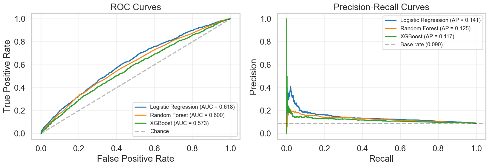
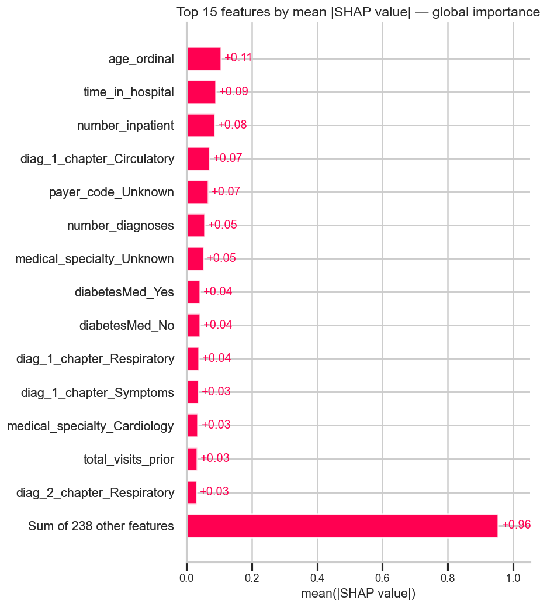

# 30-Day Hospital Readmission Prediction in Diabetic Patients

A reproducible machine learning pipeline for predicting 30-day hospital readmission in diabetic patients, with clinical-grade interpretability via SHAP. Built on the Diabetes 130-US Hospitals dataset (UCI ML Repository, ~101k encounters from 1999–2008).

## Problem

Early hospital readmission (within 30 days of discharge) in diabetic patients is a quality-of-care indicator associated with higher morbidity, mortality, and cost. In the United States, the CMS Hospital Readmissions Reduction Program penalizes hospitals based specifically on the 30-day readmission rate, and clinically this window captures readmissions most likely linked to the index admission — incomplete treatment, premature discharge, inadequate transition of care — rather than disease progression.

Identifying high-risk patients at the moment of discharge enables targeted interventions: medication reconciliation, expedited follow-up, transitional care nursing, and patient education. This project builds an end-to-end pipeline that surfaces these patients and explains *why* each one is flagged.

## Dataset

- **Source**: [UCI ML Repository — Diabetes 130-US Hospitals](https://archive.ics.uci.edu/dataset/296/diabetes+130-us+hospitals+for+years+1999-2008)
- **Volume**: 101,766 encounters across 130 U.S. hospitals (1999–2008)
- **Variables**: demographics, admission type, ICD-9 diagnoses, procedures, antidiabetic medications, HbA1c, length of stay
- **Target**: `readmitted` — binarized as `<30 days` vs. (`>30 days` or no readmission)
- **Modeling cohort after cleaning**: 69,990 unique patients (deduplicated; expired/hospice excluded). Positive class rate: 8.98%.

## Results

| Model | ROC-AUC | PR-AUC | F1 (tuned threshold) | Recall |
|---|---|---|---|---|
| Baseline (Dummy) | 0.506 | 0.091 | 0.099 | 0.099 |
| **Logistic Regression** | **0.618** | **0.141** | **0.203** | **0.483** |
| Random Forest | 0.600 | 0.125 | 0.197 | 0.440 |
| XGBoost | 0.573 | 0.117 | 0.182 | 0.450 |

Logistic Regression won across all primary metrics. Performance is consistent with the published literature on this dataset (Strack et al., 2014, and subsequent work cluster in the 0.62–0.70 ROC-AUC range). The ceiling reflects the informational limits of structured EHR data — the major determinants of readmission (medication adherence, social support, post-discharge primary-care access) are not captured here.

### Model comparison



### Top features driving the model (global SHAP)



The strongest single predictor is `number_inpatient` — prior hospitalizations in the past year — with SHAP contributions reaching +3.0 log-odds for patients with multiple prior admissions. Past hospitalization predicts future hospitalization more strongly than any other feature available.

## Key clinical findings

Three non-obvious findings emerged from the analysis. They are documented across the notebooks and informed both feature engineering and interpretation.

**1. Age and readmission risk are non-monotonic.** Young adults aged 20–30 have the highest 30-day readmission rate in the dataset (14.24%), exceeding any geriatric group. This reflects the clinical profile of young-adult diabetes admissions: predominance of type 1 diabetes, recurrent DKA, and lower medication adherence in this demographic. Older adults show a second peak driven by multimorbidity and frailty. A linear age model would average across both peaks and lose the signal.

**2. HbA1c measurement, not its value, is a care-quality signal.** Encounters where A1C was measured (regardless of result) show ~1.5 percentage points lower readmission than encounters where it was not. This is **MNAR** (Missing Not At Random): the act of ordering the test reflects active diabetes management during the admission, while its absence reflects an encounter where diabetes was managed reactively or not at all. The bivariate effect was confirmed; the multivariate effect after controlling for correlated features (specialty, medication, length of stay) was smaller than initially hypothesized — reported transparently rather than overstated.

**3. `number_diagnoses` is capped at 9 by a billing artifact.** Nearly half of all encounters have exactly 9 diagnoses, with values above 9 vanishingly rare. This is not a clinical distribution — the UB-04 hospital claim form used in U.S. billing during this era had 9 diagnosis-code slots, truncating high-comorbidity patients. The variable should be interpreted as "9 or more," not as a continuous count.

**4. "Having an identified specialist" matters as much as the specialty itself.** SHAP analysis showed `medical_specialty_Cardiology` is protective; `medical_specialty_Unknown` increases risk. The pair suggests that documented specialist involvement — implying structured handoff and defined follow-up — reduces readmission, more than any specialty-specific protocol.

## Project structure


```
diabetes-readmission/
├── notebooks/
│   ├── 01_eda.ipynb                          # Clinical exploratory data analysis
│   ├── 02_cleaning_feature_engineering.ipynb # Cohort definition, ICD-9 grouping, encoding
│   ├── 03_modeling.ipynb                     # Three models with OOF threshold tuning
│   └── 04_interpretability_shap.ipynb        # SHAP global + patient-level explanations
├── src/
│   ├── data.py                               # Data loading utilities
│   └── features.py                           # ICD-9 chapter grouping, target binarization
├── reports/
│   └── figures/                              # Exported figures (referenced above)
├── data/
│   └── raw/                                  # Place CSVs here — not versioned
└── requirements.txt

```
## Notebook walkthrough

- **`01_eda.ipynb`** — Clinical exploratory analysis. Identifies missingness patterns, the bimodal age effect, A1C as a care-quality signal, and the UB-04 billing ceiling. Produces hypotheses tested in subsequent notebooks.
- **`02_cleaning_feature_engineering.ipynb`** — Cohort definition (exclusion of expired/hospice; deduplication to one encounter per patient); ICD-9 codes grouped into 19 clinical chapters via reusable function in `src/features.py`; engineered features for measurement flags and prior utilization; output as parquet for downstream notebooks.
- **`03_modeling.ipynb`** — Three models trained with class-weight handling and no hyperparameter tuning. Documents a methodological issue (Random Forest predicted zero positives at the default 0.5 threshold under class imbalance) and corrects it via out-of-fold cross-validated threshold tuning. Comparison reported with ROC, PR-AUC, and threshold-adjusted F1.
- **`04_interpretability_shap.ipynb`** — Global SHAP importance, beeswarm direction analysis, and two patient-level waterfall plots (one high-risk, one low-risk). The low-risk case surfaces a model fragility — SHAP exposed that the prediction rested almost entirely on a single low-frequency dummy (`admission_type_Trauma Center`), demonstrating the diagnostic value of interpretability beyond aggregate metrics.

## How to reproduce

```bash
# Clone and enter
git clone https://github.com/<your-handle>/diabetes-readmission.git
cd diabetes-readmission

# Environment
conda create -n diabetes-readm python=3.12 -y
conda activate diabetes-readm
pip install -r requirements.txt

# Mac users: XGBoost requires OpenMP
brew install libomp

# Register Jupyter kernel
python -m ipykernel install --user --name diabetes-readm --display-name "Python (diabetes-readm)"

# Download dataset from UCI and place in data/raw/
# https://archive.ics.uci.edu/dataset/296/diabetes+130-us+hospitals+for+years+1999-2008
# Expected files: diabetic_data.csv, IDS_mapping.csv

# Run notebooks in order
jupyter lab
```

## Limitations and future work

- **No hyperparameter tuning.** Tree-based models (Random Forest, XGBoost) would likely close or exceed the LR gap with proper search over `max_depth`, `min_samples_leaf`, `learning_rate`. Logical next iteration.
- **No probability calibration.** Random Forest and XGBoost would benefit from `CalibratedClassifierCV` if their probabilities were to drive clinical decisions directly. Logistic Regression's probabilities are naturally well-calibrated for this problem.
- **No fairness audit.** A deployed model should be evaluated for performance differences across race, gender, age, and payer groups — particularly critical in U.S. healthcare contexts.
- **No external validation.** All evaluation was on a held-out split from the same hospital system in 1999–2008. Generalizability to current practice and different institutions has not been tested.
- **Rare-category handling.** SHAP analysis surfaced that some low-frequency one-hot dummies (e.g., `admission_type_Trauma Center`, n=21) produce outsized coefficients. A production-grade pipeline would collapse rare categories into "Other" before training.

## References

- Strack B, DeShazo JP, Gennings C, Olmo JL, Ventura S, Cios KJ, Clore JN. "Impact of HbA1c Measurement on Hospital Readmission Rates: Analysis of 70,000 Clinical Database Patient Records." *BioMed Research International*, 2014.
- Lundberg SM, Lee SI. "A Unified Approach to Interpreting Model Predictions." *Advances in Neural Information Processing Systems*, 2017.

## Author

**Rayele Moreira** — Physical therapist with a PhD in Biotechnology, focused on digital health and rehabilitation. [LinkedIn](https://www.linkedin.com/in/rayele-moreira)